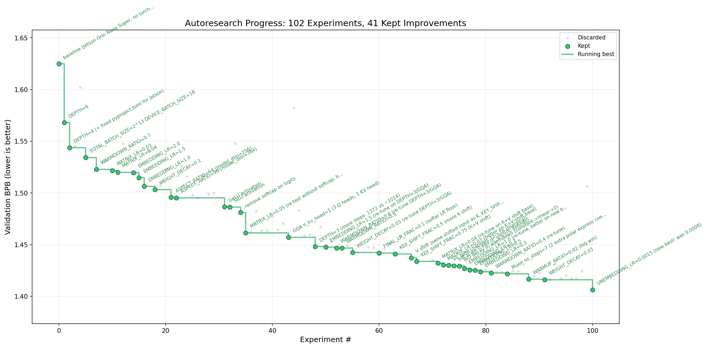

# autoresearch (RTX 4070 Laptop GPU, Windows + WSL2)



Fork of [karpathy/autoresearch](https://github.com/karpathy/autoresearch). Full credit to [@karpathy](https://github.com/karpathy) for the core idea: give an AI agent a small but real LLM training setup and let it experiment autonomously overnight. It modifies `train.py`, trains for 5 minutes, checks if the result improved, keeps or discards, and repeats. The metric is **val_bpb** (validation bits per byte) — lower is better.

This fork documents a run on an **ASUS ROG NUC Mini PC with RTX 4070 Laptop GPU under Windows + WSL2**. No code changes were needed — the upstream code runs out of the box under WSL2.

## Hardware

ASUS ROG NUC Mini PC — NVIDIA GeForce RTX 4070 Laptop GPU, 8 GB VRAM,
Windows 11 + WSL2 (Linux), CUDA 13.1, WDDM driver 591.74.
SDPA (no Flash Attention 3), torch.compile.
~1.5 GB model footprint, ~5000–6000 steps per 5-min experiment.

## Results: 2.770 → 2.495 (282 experiments, ~10% improvement)

## Final best config (exp277, val_bpb = 2.495532)

```python
DEPTH = 6
ASPECT_RATIO = 32         # model_dim=256, 2 heads, HEAD_DIM=128
MLP_HIDDEN = 3x
TOTAL_BATCH_SIZE = 2**14  # 16K tokens
DEVICE_BATCH_SIZE = 32
WARMUP_RATIO = 0.05
WARMDOWN_RATIO = 0.85
WEIGHT_DECAY = 0.15       # constant (no schedule)
EMBEDDING_LR = 2.5
MATRIX_LR = 0.02
UNEMBEDDING_LR = 0.0008
ADAM_BETAS = (0.8, 0.98)
# MUON:
momentum = 0.95, beta2 = 0.98, ns_steps = 12
# Architecture:
QK-norm before RoPE
softcap = 15
RoPE base = 10000
x0_lambdas init = 0.1, resid_lambdas = 1.0
# Separate WD param groups (from Karpathy #43):
embed_wd = 0.001, value_embeds_wd = 0.003, lm_head_wd = 0.01
# Token shift on K only, 1/4 channels (from cerebustech-dev #108):
token_shift_K_fraction = 0.25
```

## Progress curve (all keeps)

| commit  | val_bpb  | description |
|---------|----------|-------------|
| 71a3972 | 2.770532 | baseline |
| af53e60 | 2.714456 | WARMDOWN_RATIO=0.6 |
| fc2bf03 | 2.702443 | WARMDOWN_RATIO=0.9 |
| 4e25239 | 2.677238 | ADAM_BETAS beta2=0.98 |
| edeb99e | 2.672176 | ADAM_BETAS beta1=0.8 |
| 7dbd063 | 2.667557 | MUON beta2=0.98 |
| d05981f | 2.665535 | EMBEDDING_LR=1.2 |
| c46cc1b | 2.648800 | UNEMBEDDING_LR=0.002 |
| 4f5a3cf | 2.641592 | WEIGHT_DECAY=0.3 |
| 3606eda | 2.632197 | MUON ns_steps=12 |
| 7ada9a5 | 2.604692 | model_dim=256, 2 heads (big win) |
| aa2e675 | 2.624541 | DEPTH=6 |
| 4220e63 | 2.573393 | TOTAL_BS=2^14 (huge win) |
| e65a9e5 | 2.556784 | MATRIX_LR=0.02 + UE_LR=0.001 combo |
| 5e3a948 | 2.539082 | EMBEDDING_LR=2.5 |
| e8078a0 | 2.550433 | QK-norm before RoPE |
| eb7e9c5 | 2.547444 | WEIGHT_DECAY=0.1 |
| fcc9fdd | 2.533981 | MLP 3x hidden |
| 654cbaf | 2.526795 | Constant WD=0.15 |
| d97f41f | 2.524369 | UE_LR=0.0008 |
| e3acf33 | 2.518763 | WARMDOWN_RATIO=0.85 |
| 7456351 | 2.517405 | WUR=0.05 + WDR=0.85 |
| 68accbc | 2.496191 | token shift K-only 1/4 ch (from #108) |
| e995b07 | 2.495532 | separate WD embed/VE/lm_head (from #43) **FINAL BEST** |

## Key findings vs H100 upstream (#43)

| Hyperparameter | H100 optimal | RTX 4070 / WSL2 optimal |
|---|---|---|
| RoPE base | 200K | 10K |
| Depth | 9 | 6 |
| MLP size | 4x | 3x |
| Warmdown ratio | 0.75 | 0.85 |
| Embedding LR | ~0.9 | 2.5 |
| Weight decay | 0.2 | 0.15 |
| Warmup | hurts | WUR=0.05 helps |
| TOTAL_BS | larger | 2^14 |

## Confirmed universal (cross-platform)

- Tied embeddings → catastrophic (2.770 → 5.78)
- Parallel attn+MLP → worse
- Label smoothing → catastrophic (2.517 → 2.78)
- VE is load-bearing (+0.14 bpb penalty when removed)
- Smaller batch → more steps → better val_bpb
- Warmdown tuning is the biggest schedule lever

## Community findings tested on this hardware

7 experiments based directly on prior discussions:

**From cerebustech-dev's GB10 run ([#108](https://github.com/karpathy/autoresearch/discussions/108)):**

| exp | val_bpb | result | note |
|-----|---------|--------|------|
| exp274: token shift K-only 1/4 ch | 2.496191 | ✅ **−0.021 NEW BEST** | 1/4 better than 1/8 here |
| exp275: token shift K-only 1/8 ch | 2.517625 | ❌ worse than 1/4 | GB10 sweet spot doesn't transfer |
| exp276: token shift Q+K 1/4 ch | 2.562663 | ❌ K-only confirmed better | |
| exp278: embedding noise std=0.008 | 2.530686 | ❌ +0.035 bpb | hurts on this hardware |
| exp279: post-norm RMSNorm before c_proj | 2.544060 | ❌ +0.049 bpb | hurts on this hardware |

**From Karpathy's H100 session ([#43](https://github.com/karpathy/autoresearch/discussions/43)):**

| exp | val_bpb | result | note |
|-----|---------|--------|------|
| exp273: INIT_SCALE=0.68 | 2.560385 | ❌ +0.043 bpb | does not transfer |
| exp277: separate WD embed/VE/lm_head | 2.495532 | ✅ **−0.001 FINAL BEST** | small but consistent |

## Notable failures (specific to this hardware)

- INIT_SCALE=0.68 (Karpathy #43 win on H100): hurts here
- Post-norm before c_proj (cerebustech-dev #108 win): hurts here
- Embedding noise std=0.008 (cerebustech-dev #108 win): hurts here
- DEPTH=9+ (H100 optimal): undertrained even at 5K+ steps, worse
- TOTAL_BS=2^15 or larger: noisy gradients, worse despite more data
- SwiGLU (GB10 win): slower and worse on this GPU

## Platform note: Windows + WSL2

The upstream autoresearch code runs without any modifications under WSL2.
torch.compile, CUDA kernels, and uv all work natively. The WDDM driver
transparently exposes the RTX 4070 Laptop GPU to the Linux WSL2 environment.
No fork or code changes needed — just clone and run.

## Quick start

**Requirements:** Python 3.10+, [uv](https://docs.astral.sh/uv/), NVIDIA GPU.

```bash
# 1. Install uv (if you don't already have it)
curl -LsSf https://astral.sh/uv/install.sh | sh

# 2. Install dependencies
uv sync

# 3. Download data and train tokenizer (one-time, ~2 min)
uv run prepare.py

# 4. Manually run a single training experiment (~5 min)
uv run train.py
```

Then point Claude Code or another coding agent at `program.md` and let it run the loop.

## Acknowledgments

- [Andrej Karpathy](https://github.com/karpathy) — [karpathy/autoresearch](https://github.com/karpathy/autoresearch) and the original idea
- [cerebustech-dev](https://github.com/cerebustech-dev) — GB10 Blackwell run, token shift K-only finding ([#108](https://github.com/karpathy/autoresearch/discussions/108))
- [heidiEC](https://github.com/heidiEC) — cross-platform graph prior ([#195](https://github.com/karpathy/autoresearch/discussions/195))

## License

MIT
